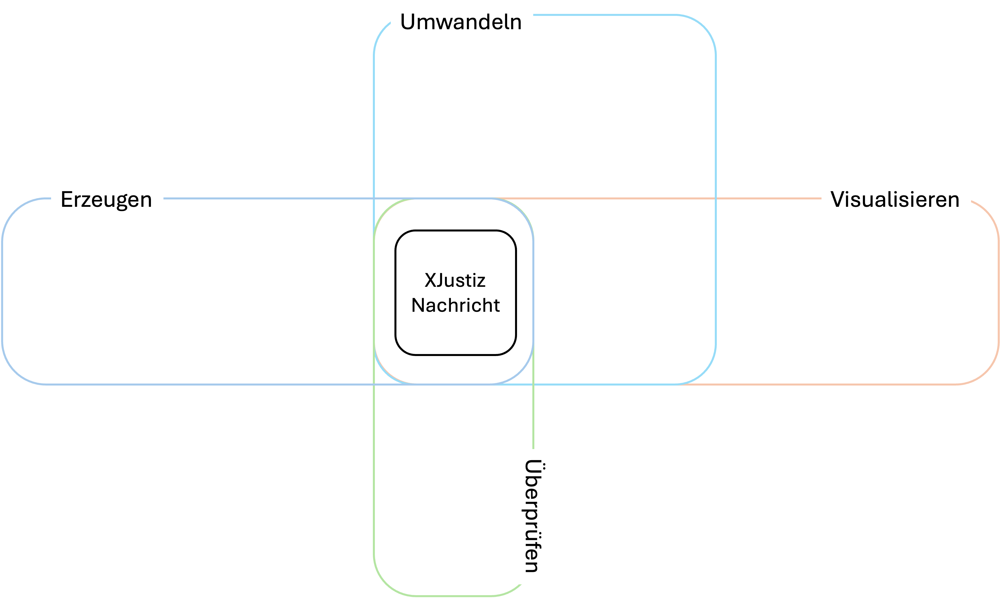
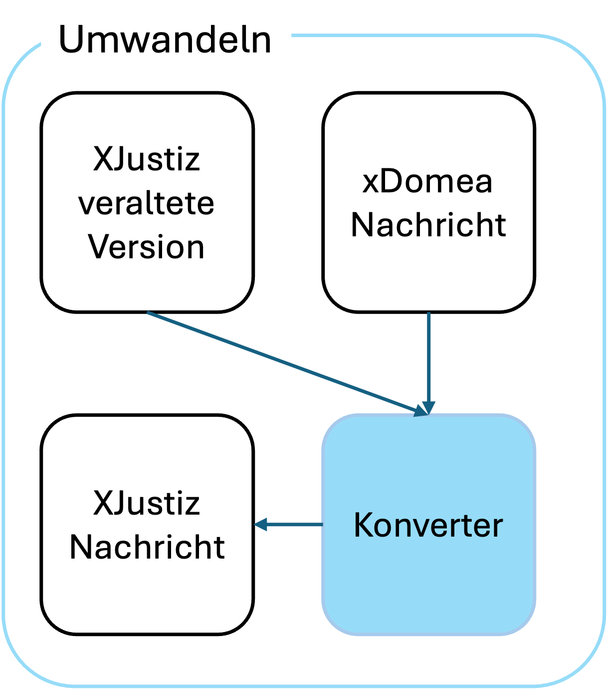
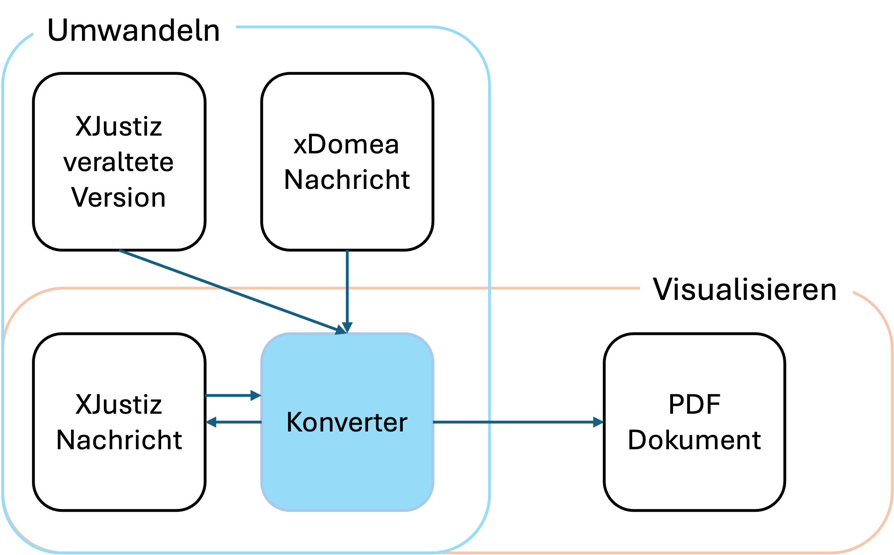
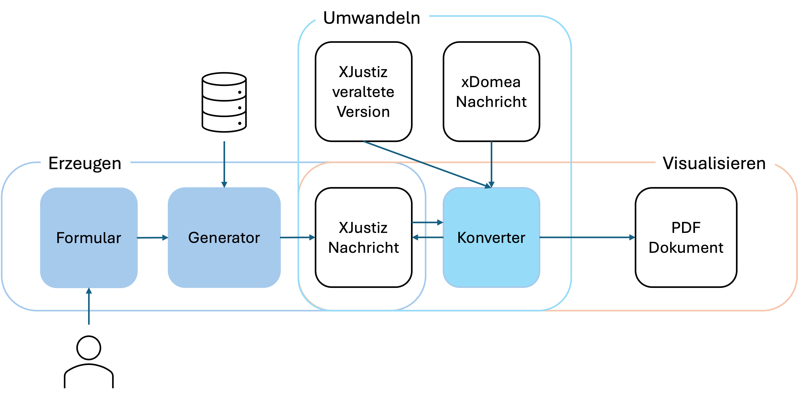
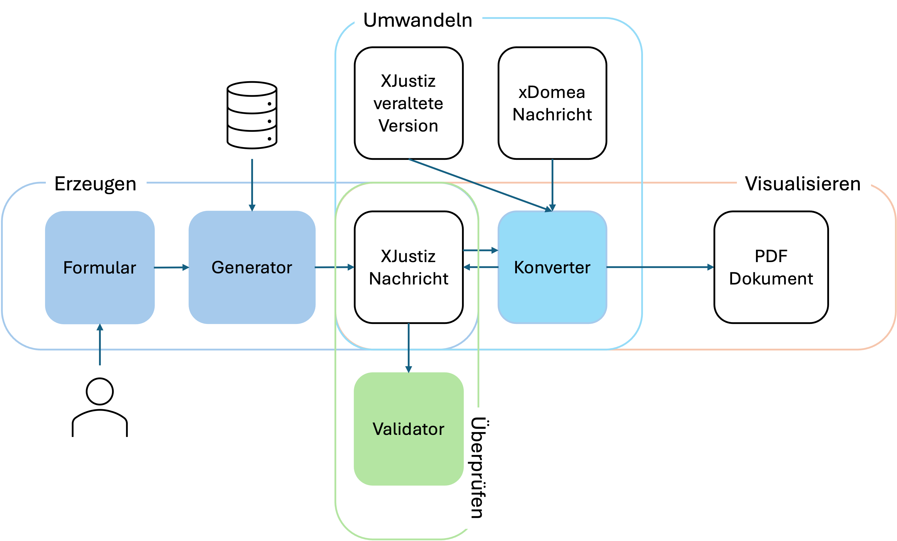

# Werkzeuge

Die XJustiz-Werkzeuge unterstützen Fachanwender und Entwickler beim effizienten Umgang mit dem XJustiz-Standard. Sie ermöglichen das Erstellen, Bearbeiten und Visualisieren von XJustiz-Nachrichten, prüfen diese fachlich und technisch und unterstützen die Umwandlung von XÖV-Formaten in XJustiz.
So erleichtern sie Integration, Qualitätssicherung und den sicheren Datenaustausch im elektronischen Rechtsverkehr.

{ width="80%" }

## Umwandeln (Konvertor)
Die Werkzeuge unterstützen die Konvertierung veralteter XJustiz-Versionen in die jeweils aktuelle Fassung sowie die Transformation von xdomea-Formaten nach XJustiz. Dadurch wird die langfristige Kompatibilität und Weiterverarbeitung bestehender Datenbestände sichergestellt. 

{ width="40%" }

## Visualisieren (Konvertor)
Die Werkzeuge wandeln XJustiz-Nachrichten in übersichtliche PDF-Dokumente um. So werden maschinenlesbare Daten verständlich und anwenderfreundlich aufbereitet und können komfortabel geprüft, geteilt oder archiviert werden.

{ width="80%" }

## Erzeugen und bearbeiten (Generator)
Intuitive Webformulare unterstützen die strukturierte Erfassung aller relevanten Fachdaten. Die eingegebenen Informationen werden automatisiert angereichert, validiert und anschließend in standardkonforme XJustiz-Nachrichten überführt.

{ width="80%" }

## Überprüfen (Validator)
Der Validator prüft XJustiz-Nachrichten fachlich und technisch auf Vollständigkeit, Struktur und Regelkonformität. So wird eine fehlerfreie Verarbeitung und ein reibungsloser Datenaustausch sichergestellt.

{ width="80%" }

## Bezug

Die XJustiz-Werkzeuge werden über eine zentrale Plattform kostenfrei zum Download bereitgestellt. Zugangsdaten können über das Funktionspostfach [it-standards@justiz.de](mailto:it-standards@justiz.de) angefragt werden.
Für Rückfragen, Feedback oder Fehlermeldungen steht ebenfalls it-standards@justiz.de zur Verfügung.
Zur technischen Integration umfasst das Paket sowohl eine Java-Bibliothek zur Einbindung in Drittanwendungen als auch eine REST-Schnittstelle, die als Webservice angebunden werden kann.
